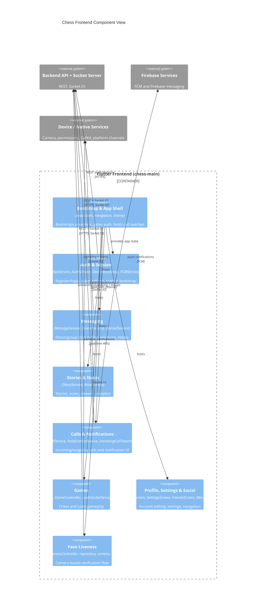

# Flutter Frontend UML

This document merges the frontend structure found under `chess-main/lib` into a single UML-style view.

## Component View

```mermaid
C4Component
title Chess Frontend Component View

System_Ext(backend, "Backend API + Socket Server", "REST, Socket.IO")
System_Ext(firebase, "Firebase Services", "FCM and Firebase messaging")
System_Ext(native, "Device / Native Services", "Camera, permissions, CallKit, platform channels")

Container_Boundary(frontend, "Flutter Frontend (chess-main)") {
  Component(shell, "Bootstrap & App Shell", "main.dart, navigation, theme", "Bootstraps providers, gates auth, hosts call overlays")
  Component(auth, "Auth & Session", "ApiService, AuthService, DeviceBootstrap, FCMService", "Register/login, token refresh, startup bootstrap")
  Component(chat, "Messaging", "MessageService, FriendService, UploadService", "Direct/group chat, typing, reactions, media")
  Component(content, "Stories & Notes", "StoryService, NoteService", "Stories, notes, viewers, analytics")
  Component(calls, "Calls & Notifications", "CallService, NotificationService, IncomingCallToastHost", "Incoming/outgoing calls and notification UI")
  Component(games, "Games", "GameProvider, GameController, LudoSocketService, ChessGame", "Chess and Ludo gameplay")
  Component(profile, "Profile, Settings & Social", "ProfileScreen, SettingsScreen, FriendsScreen, MenuScreen", "Account editing, settings, navigation")
  Component(liveness, "Face Liveness", "FaceLivenessController, repository, screens, widgets", "Camera-based verification flow")
}

Rel(shell, auth, "provides app state")
Rel(shell, chat, "hosts")
Rel(shell, content, "hosts")
Rel(shell, calls, "hosts")
Rel(shell, games, "hosts")
Rel(shell, profile, "hosts")
Rel(shell, liveness, "routes to")

Rel(auth, backend, "REST auth/session", "HTTPS")
Rel(chat, backend, "REST + Socket.IO", "HTTPS, Socket.IO")
Rel(content, backend, "REST + Socket.IO", "HTTPS, Socket.IO")
Rel(calls, backend, "signaling + alerts", "Socket.IO")
Rel(calls, firebase, "push notifications", "FCM")
Rel(calls, native, "CallKit / platform UI", "platform channel")
Rel(liveness, native, "camera, permissions", "platform APIs")
Rel(games, backend, "online matchmaking / moves", "Socket.IO")
```

## Class View

```mermaid
classDiagram
direction LR

class MessengerColors
class MessengerTheme
class BackendConfig
class ApiService
class AuthService
class FriendService
class UploadService
class MessageService
class NoteService
class StoryService
class CallService
class NotificationService
class ThemeService
class SoundService
class DeviceBootstrap
class FCMService
class SocketService
class GameProvider
class GameController
class LudoGameLogic
class LudoSocketService
class RoomManager
class AIPlayer
class AIDifficultyFactory
class ChessGame
class FaceLivenessController
class FaceLivenessRepository
class FaceLivenessRepositoryImpl
class GameSound

class User
class AuthResponse
class Message
class ChatUser
class GroupMember
class GroupChat
class Note
class NoteGroup
class Story
class StoryGroup
class Notification
class CallType
class CallStatus
class CallParticipant
class CallInvitation
class Token
class Player
class BoardConfig
class GameState
class ChessColor
class ChessPiece
class LivenessStep
class LivenessResult
class FrameMetrics

class BootstrapGate
class ChessApp
class AuthGate
class LoginScreen
class RegisterScreen
class ChessBoardScreen
class MessagingScreen
class ChatScreen
class StoryViewerScreen
class StoriesBar
class NotesBar
class AddStoryScreen
class AddNoteScreen
class NoteViewerScreen
class StoryAnalyticsScreen
class ProfileScreen
class SettingsScreen
class NotificationsScreen
class FriendsScreen
class MenuScreen
class CallScreen
class IncomingCallScreen
class LudoHomeScreen
class LudoGameScreen
class LivenessPermissionScreen
class FaceLivenessScreen
class LivenessSuccessScreen
class LivenessFailureScreen
class NotificationBell
class NotificationPanel
class IncomingCallToastHost
class IncomingCallToast
class CancelMatchButton
class ScannerOverlay
class LivenessStatusCard

MessengerTheme ..> MessengerColors : uses
BackendConfig ..> ApiService : config
ChessApp ..> MessengerTheme : theme
ChessApp ..> AuthService : provider tree
ChessApp ..> CallService : provider tree
ChessApp ..> MessageService : provider tree
ChessApp ..> NoteService : provider tree
ChessApp ..> StoryService : provider tree
ChessApp ..> NotificationService : provider tree
ChessApp ..> GameProvider : provider tree
ChessApp ..> SoundService : provider tree

AuthService ..> ApiService : auth API
AuthService ..> User : session
AuthService ..> AuthResponse : parses
AuthService ..> SharedPreferences : token cache
FriendService ..> ApiService : contacts API
MessageService ..> FriendService : contacts
MessageService ..> ApiService : messages API
MessageService ..> UploadService : media upload
MessageService ..> Message : chat data
MessageService ..> ChatUser : conversation list
MessageService ..> GroupChat : group chat data
MessageService ..> User : current profile
NoteService ..> ApiService : notes API
NoteService ..> Note : note data
NoteService ..> NoteGroup : grouped notes
StoryService ..> ApiService : stories API
StoryService ..> Story : story data
StoryService ..> StoryGroup : grouped stories
CallService ..> CallInvitation : incoming calls
CallService ..> CallParticipant : RTC participants
CallService ..> CallStatus : call lifecycle
CallService ..> CallType : audio/video
CallService ..> User : caller/callee profile
NotificationService ..> CallService : listens to call state
NotificationService ..> Notification : inbox items
ThemeService ..> SharedPreferences : preference storage
SoundService ..> GameSound : effects
FCMService ..> CallService : call notifications
FCMService ..> FirebaseMessaging : push
DeviceBootstrap ..> FCMService : bootstrap
SocketService ..> ApiService : socket base URL

GameProvider ..> GameController : owns
GameProvider ..> LudoSocketService : online sync
GameProvider ..> AIPlayer : offline AI
GameController ..> GameState : state
GameController ..> LudoGameLogic : rules
LudoGameLogic ..> BoardConfig : board constants
LudoGameLogic ..> Token : move rules
LudoGameLogic ..> Player : move rules
AIPlayer ..> LudoGameLogic : evaluates moves
AIDifficultyFactory ..> AIPlayer : creates
LudoSocketService ..> GameState : sync payloads
LudoSocketService ..> Player : match data
RoomManager ..> LudoSocketService : room ids

ChessGame ..> ChessPiece : board
ChessGame ..> ChessColor : turn / pieces

FaceLivenessController ..> FaceLivenessRepository : contract
FaceLivenessRepository <|.. FaceLivenessRepositoryImpl
FaceLivenessController ..> LivenessStep : progress
FaceLivenessController ..> LivenessResult : result
FaceLivenessRepositoryImpl ..> FrameMetrics : analysis
FaceLivenessRepositoryImpl ..> LivenessResult : builds

BootstrapGate ..> ApiService : initialize
BootstrapGate ..> DeviceBootstrap : startup
BootstrapGate ..> FCMService : optional init
AuthGate ..> AuthService : route guard

LoginScreen ..> AuthService : login
RegisterScreen ..> AuthService : register
ChessBoardScreen ..> ChessGame : local engine
ChessBoardScreen ..> AuthService : user context
ChessBoardScreen ..> ThemeService : theme
MessagingScreen ..> AuthService : home
MessagingScreen ..> MessageService : chat hub
MessagingScreen ..> NoteService : notes tray
MessagingScreen ..> StoryService : stories tray
MessagingScreen ..> CallService : calls
MessagingScreen ..> NotificationService : alerts
MessagingScreen ..> FriendService : social
ChatScreen ..> MessageService : conversation
StoryViewerScreen ..> StoryService : views/reactions
StoryViewerScreen ..> MessageService : replies
StoriesBar ..> StoryService : preload
StoriesBar ..> NoteService : preload
NotesBar ..> NoteService : preload
AddStoryScreen ..> StoryService : compose
AddNoteScreen ..> NoteService : compose
NoteViewerScreen ..> NoteService : viewer
StoryAnalyticsScreen ..> StoryService : analytics
ProfileScreen ..> MessageService : profile update
SettingsScreen ..> AuthService : logout/user
NotificationsScreen ..> NotificationService : list
FriendsScreen ..> FriendService : contacts
MenuScreen ..> NotificationService : panel
CallScreen ..> CallService : RTC
IncomingCallScreen ..> CallService : accept/reject
LudoHomeScreen ..> GameProvider : match/launch
LudoGameScreen ..> GameProvider : gameplay
CancelMatchButton ..> GameProvider : cancel
FaceLivenessScreen ..> FaceLivenessController : scan
LivenessPermissionScreen ..> FaceLivenessScreen : next step
LivenessStatusCard ..> FaceLivenessController : status
ScannerOverlay ..> FaceLivenessScreen : overlay
NotificationBell ..> NotificationService : badge
NotificationPanel ..> NotificationService : sheet
IncomingCallToastHost ..> CallService : toast overlay
IncomingCallToast ..> CallService : dismiss/open

User <|-- AuthResponse
GroupChat o-- GroupMember
GroupChat o-- Message
ChatUser o-- Message
NoteGroup o-- Note
StoryGroup o-- Story
CallInvitation --> CallType
Player *-- Token
GameState *-- Player
ChessGame o-- ChessPiece
ChessPiece --> ChessColor
```
